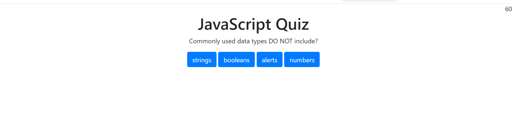

# 04 Web APIs: Code Quiz
## Description

Homework assignment for students to design a quiz to take.

## Table of contents

* [Create](#create)
* [Usage](#usage)
* [Credits](#credits)
* [License](#license)

## create

1. Create a basic Html page
2. Use javascript to design the quiz mainly
3. Have a start button and timer
4. Give 5 questions and progress to the next question when answered correctly
5. Quiz ends when all questions are answered correctly or timer hits zero or goes below zero
6. Show the score at the end, which is the remaining time

## Usage

[Deployed Website](https://lead81.github.io/codeQuiz-hw4/)

## Credits

Google.com and the GT coding boot camp team/activities.
W3Schools.com
Class mates
Tutors

## License

Permission is hereby granted, free of charge, to any person obtaining a copy of this software and associated documentation files (the "Software"), to deal in the Software without restriction, including without limitation the rights to use, copy, modify, merge, publish, distribute, sublicense, and/or sell copies of the Software, and to permit persons to whom the Software is furnished to do so, subject to the following conditions:

The above copyright notice and this permission notice shall be included in all copies or substantial portions of the Software.

THE SOFTWARE IS PROVIDED "AS IS", WITHOUT WARRANTY OF ANY KIND, EXPRESS OR IMPLIED, INCLUDING BUT NOT LIMITED TO THE WARRANTIES OF MERCHANTABILITY, FITNESS FOR A PARTICULAR PURPOSE AND NONINFRINGEMENT. IN NO EVENT SHALL THE AUTHORS OR COPYRIGHT HOLDERS BE LIABLE FOR ANY CLAIM, DAMAGES OR OTHER LIABILITY, WHETHER IN AN ACTION OF CONTRACT, TORT OR OTHERWISE, ARISING FROM, OUT OF OR IN CONNECTION WITH THE SOFTWARE OR THE USE OR OTHER DEALINGS IN THE SOFTWARE.